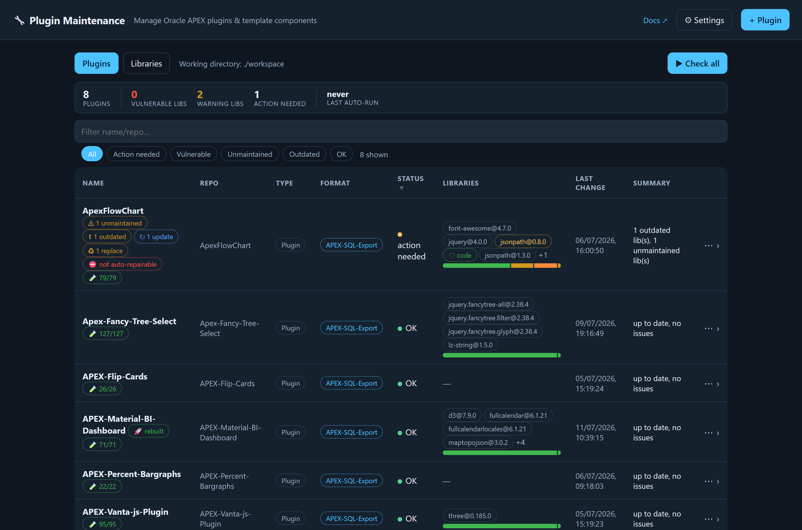
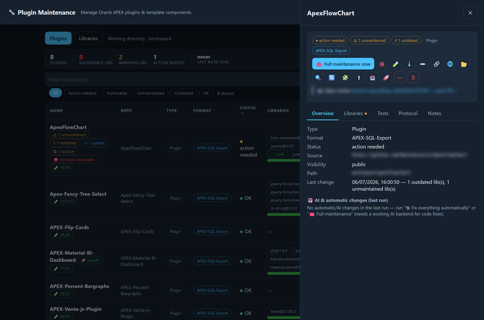
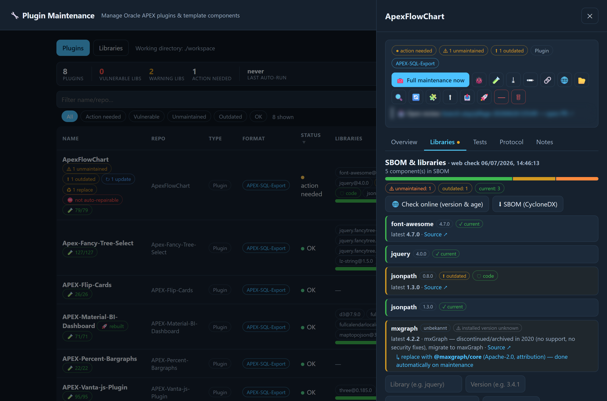
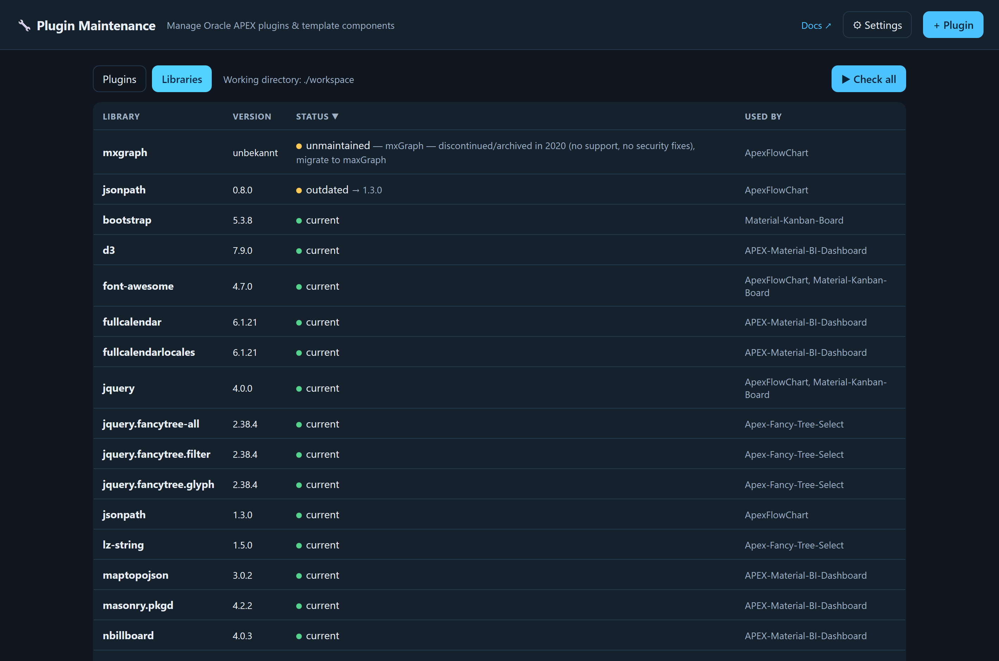
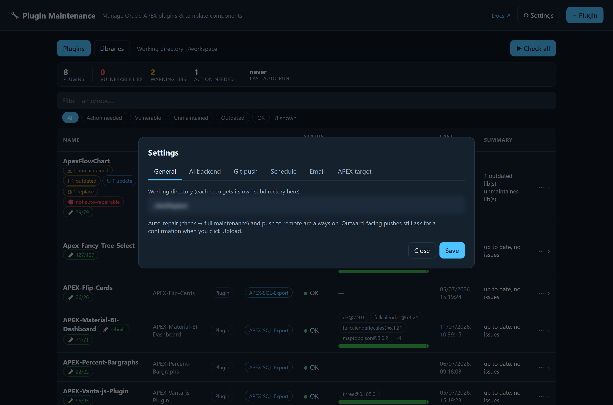
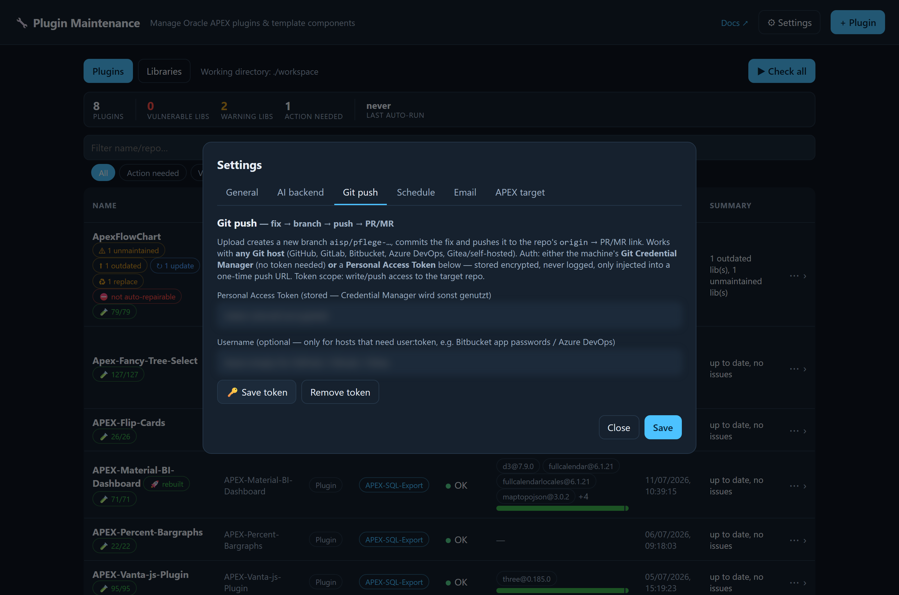

# Plugin Maintenance

[](https://www.paypal.me/medinchen)

> 💙 **Find this useful?** [Support the project on PayPal → paypal.me/medinchen](https://www.paypal.me/medinchen)

**Autonomous maintenance for Oracle APEX plugins & template components.** It clones your
plugin repos, builds a self‑testing characterization mock, keeps the vendored JavaScript
libraries up to date — including inside the *bundled files that are actually shipped and
installed into APEX* — verifies "works exactly as before", installs into a real APEX test
app, and opens a pull request. All from a small web UI or headless on a schedule.

> Dependency‑light Node.js (ESM, Node ≥ 20). No framework, no database — everything lives
> in flat files under `data/` and a working copy per repo under `workspace/`.

---

## Why this exists

Keeping a fleet of APEX plugins current is tedious and risky: libraries go stale or change
their license, a "simple" update can silently break rendering, and — the subtle one — many
plugins **bundle and embed** their JS/CSS as base64 blobs inside the plugin `.sql`, so
updating `js/lib/*.js` alone never reaches the deployed plugin. Plugin Maintenance handles
all of that automatically and, crucially, **honestly**: it tells you when it couldn't verify
something instead of pretending everything is green.

## What it does

- **Inventory & SBOM** — detects vendored libraries (even minified, no version in the name)
  and builds a CycloneDX SBOM per component.
- **Library health** — online version/age check against npm, "outdated / unmaintained /
  vulnerable / unknown / current" per lib, with source links.
- **Real updates that reach APEX** — safe (minor/patch) updates are applied; then the
  **bundles are rebuilt and re‑embedded into the plugin `.sql`** so the deployed plugin
  actually runs the new version. Works for gulp‑concat bundles *and* directly‑embedded files,
  across region / item / dynamic‑action / **template‑component** plugins.
- **License watch** — flags when a library's license *changes* on update (e.g. MIT → GPL),
  in the UI and in the report e‑mail, so nothing legally risky slips in unnoticed.
- **AI characterization mock** — a plugin‑specific, self‑testing harness is written for each
  plugin; its self‑checks catch not just harness failures but visible error tiles, console
  errors and 404s, and an AI refine loop fixes them.
- **Before/after gate ("works as before")** — a baseline is frozen *before* any change; after
  updating, the plugin is compared to that baseline (scenarios + screenshot) and **rolled
  back on regression**.
- **Live APEX deploy & test** — installs the plugin into a configured APEX target app, builds
  an analysis‑driven test page, and does a headless render smoke test.
- **Feedback → permanent regression test** — report a bug the tests missed (text +
  screenshots); the AI analyses it, adds a regression test that runs from then on, and starts
  the rework.
- **Report & PR** — commits the fix on a new branch and pushes it (any Git host — GitHub,
  GitLab, Bitbucket, Azure DevOps, Gitea, self‑hosted), with a PR/MR link and an optional
  SMTP report.

## Quick start

```bash
npm install
node start.js serve            # web UI + scheduler on http://localhost:4317
# or a one-off, read-only run over a repo:
node start.js scan <path-or-git-url>
```

Open **http://localhost:4317**, add a plugin via **+ Plugin** (Git URL or local path), and
hit **🧰 Full maintenance now**. For the live APEX steps and UI tests you also need the
browser once:

```bash
npx playwright install chromium
```

## User guide

> Screenshots below are from the running app (`node start.js serve` → http://localhost:4317).
> Values you typed in *Settings* and repo URLs/paths are blurred on purpose — they are not
> part of the UI.

### 1 · Overview



The landing page lists every plugin and template component you manage.

- **KPI bar** — total plugins, vulnerable libs, warning libs, how many need action, and when
  the scheduler last ran.
- **Filter bar** — free‑text filter plus quick chips (*Action needed / Vulnerable /
  Unmaintained / Outdated / OK*). Column headers with an arrow are sortable.
- **Row badges** tell you the state at a glance: `1 unmaintained`, `1 outdated`, `1 update`,
  `1 replace`, `rebuilt` (bundles were re‑embedded into the `.sql`), `not auto‑repairable`,
  and a green `n/n` test‑coverage pill.
- **Libraries column** shows the top libraries plus a **health bar** (green = current,
  yellow = outdated/unmaintained, orange/red = vulnerable).
- **▶ Check all** runs a read‑only analysis over every plugin. Click any row to open its
  drawer.

### 2 · Plugin drawer — Overview tab



Each plugin opens a drawer. The **icon action bar** is always visible; hover any icon for its
full description. Only *Full maintenance now* carries a label — it is the primary action.

| Icon | Action | What it does |
|------|--------|--------------|
| 🧰 | **Full maintenance now** | Full cycle: check → web lib‑check → apply SAFE lib updates → auto‑fix → re‑test. Writes files; pushes only if allowed. |
| 🐞 | Report issue… | Report a bug the tests missed (text + screenshots). AI adds a permanent regression test and starts the rework. |
| 🧪 | Open mock | Open the rendered characterization mock in a new tab. |
| ⤓ | Requirements | Export the "works‑as‑before" acceptance requirements as a Gherkin `.feature`. |
| ✏ | Edit | Edit the plugin name / repo path. |
| 🔗 | Assign repo | Connect/clone the Git repo so check, tests and lib detection work. |
| 🌐 / 📂 | Open Git / locally | Open the repo URL, or the local working copy. Read‑only. |
| 🔍 | Manual review | Security + quality gate. Read‑only. |
| 🔄 | Rebuild requirements | Re‑derive the acceptance requirements from the mock self‑test. |
| 🧩 | Setup‑JSON | Build the APEX setup recipe (JSON) from the analysis and download it. |
| 🧬 | Re‑develop | Dead library without an obligation‑free equivalent successor → rewritten from the interfaces (slice‑wise, against the acceptance contract). |
| ⬆ | Update libs to latest | Safe updates applied directly; breaking ones offer a force option or verified migration. |
| 📤 | Upload (branch + PR) | Commit changes on a **new** branch, push, and show the PR/MR link. **Asks for confirmation.** |
| 🚀 | Deploy to APEX & live‑test | Install into the configured APEX app, build a test page, headless render check. Needs the APEX connection in *Settings*. |
| — / 🗑 | Remove / Delete everywhere | Remove from this tool's list only, or delete everywhere (tool, APEX page + plug‑in, disk) — the latter asks for the exact name. |

The **Overview tab** shows type, format, source, visibility, local path, last change, and a
summary of the AI/automatic changes from the last run.

### 3 · Plugin drawer — Libraries tab



Per‑plugin SBOM and library health. The health bar and the `unmaintained / outdated /
current` counters summarise the component. Each library is a card with its installed and
latest version, status, license, a **Source ↗** link, and — where relevant — a note such as
*"adapter to dayjs (MIT, no obligations) — only an adapter is written, plugin code stays
unchanged (needs approval)"* or *"no obligation‑free equivalent successor → rewritten from
the interfaces (MIT) on maintenance (needs approval)"*.
**Check online (version & age)** refreshes against npm; **SBOM (CycloneDX)** downloads the bill
of materials.

### 4 · Libraries (global, sortable)



Switch to **Libraries** in the top bar for a fleet‑wide view of every library across all
plugins. Click a column header to sort — the default is **status criticality** first
(unmaintained/vulnerable on top), then library, version, used‑by. The *Used by* column links
each library back to the plugins that ship it.

### 5 · Settings



Settings are grouped into tabs:

- **General** — the working directory (each repo gets its own subfolder here).
- **AI backend** — a local CLI (e.g. `claude`) or an HTTP provider + key.
- **Git push** — token *or* the machine's Git Credential Manager, for any host (see below).
- **Schedule** — cron expression for unattended maintenance.
- **Email** — SMTP settings for the report mail (incl. license‑change warnings).
- **APEX target** — connection to the APEX app used for live deploy & test‑page setup.

**APEX target — you only need URL, workspace and login.** Enter *Base URL* (`https://<host>/ords`),
*Workspace*, *Login user* and *Password*, then click **🔍 Detect IDs from APEX**: the tool signs
in to the target instance, fills **Workspace‑ID** and **Owner (parsing schema)** automatically
and lists the workspace's apps so you can pick the target **test app** (it never picks one for
you — create a dedicated empty test app first if the workspace has none; the tool builds its
test pages there, from page 20000 up). Switching to a different app resets stale per‑plugin
page registers automatically.

*Manual fallback* (if Detect can't drive your instance's UI): the App‑ID is the number on the
app's tile in the App Builder; Workspace‑ID and Owner come from **SQL Workshop → SQL Commands**:

```sql
select workspace, workspace_id,
       sys_context('userenv','current_schema') as owner
  from apex_workspaces;
```

…or from the header of any app export file (`p_default_workspace_id`, `p_default_owner`,
`p_default_application_id` — in newer APEX versions inside `wwv_flow_imp.import_begin`,
in older ones `wwv_flow_api.import_begin`).



**Git push** works with any Git host (GitHub, GitLab, Bitbucket, Azure DevOps,
Gitea/self‑hosted). Either rely on the machine's **Git Credential Manager** (no token
needed) or paste a **Personal Access Token** — it is stored encrypted, never logged, and only
injected into a one‑time push URL. The optional *Username* is only needed for hosts that use
`user:token` (Bitbucket app passwords, Azure DevOps).

### Typical workflows

- **Add & check a plugin** — **+ Plugin** → paste a Git URL or local path (or use the file
  import at the bottom for non‑Git exports) → open the row → **🧰 Full maintenance now**.
- **Ship a fix** — after maintenance turns the row green, open the drawer → **📤 Upload** →
  confirm → follow the PR/MR link.
- **Preview in APEX** — configure *Settings → APEX target* once, then **🚀 Deploy to APEX &
  live‑test** on any plugin.
- **Report something the tests missed** — **🐞 Report issue…**, attach a screenshot; the AI
  turns it into a permanent regression test and reworks the plugin.
- **Run the whole fleet unattended** — set a cron in *Settings → Schedule*; green results can
  auto‑upload, red ones never do.

## How a maintenance run works

```
check → web lib‑check → freeze baseline (before)
      → apply SAFE lib updates → rebuild + re‑embed bundles into the .sql → auto‑fix
      → rebuild mock (after) → works‑as‑before gate  → rollback on regression
      → live deploy & render check in APEX → report / branch + PR
```

Breaking (major) updates and dead/unmaintained libraries aren't swapped blindly — they go
through an AI migration + the works‑as‑before gate and are adopted only after review.

**Unmaintained libraries need your approval** before anything is replaced or rebuilt. The
rule: if a **commercially free, obligation‑free** (MIT/ISC/0BSD — attribution already counts
as an obligation) and **functionally equivalent** successor exists, only an **adapter** is
written — it exposes exactly the old API surface the plugin uses, and the plugin's own code
stays untouched. Otherwise the used capability is **rewritten from the characterized
interfaces** (own MIT code, obligation‑free helpers only). Each run proposes the plan and
waits for **Approve & replace** — or enable *Settings → General → Auto‑replace unmaintained
libraries* to skip the per‑run question. Either way the result is adopted only if it still
works as before, otherwise it is rolled back.

## Safety & security

- **Nothing is pushed without you.** Outward pushes are gated and the Upload button asks for
  confirmation. Runs work on a new branch; your default branch is never touched.
- **Secrets are encrypted** (AES‑256‑GCM in `data/secrets.json`), never logged, never echoed
  back; Git tokens are only injected into a one‑time push URL and never written to `.git/config`.
- **Reserved APEX pages are respected** — each plugin gets its own registered test page; the
  tool never overwrites existing pages.
- **Honest reporting** — when a lib's runtime asset can't be rebuilt, or a baseline can't
  verify "as before", it says so instead of claiming success.

## `mcp-apex-deploy` — standalone MCP server

`mcp-apex-deploy/` is a dependency‑free MCP server (stdio) that installs an APEX export
headless and builds/render‑tests a page — generically for plugin / template‑component / page.
The main app reuses its automation library (`lib/apex-ui.js`, `lib/setup.js`,
`lib/plugin-assets.js`), so the "analysis → setup manifest (JSON) → install" path is shared.

## Project layout

```
start.js                 CLI (scan | serve | help) + web server
public/app.html          single‑file web UI
src/
  sbom/                  vendored‑lib detection, npm registry, licenses
  service/               maintain, lib‑update + re‑embed, autofix, baseline, apex‑live, feedback …
  test/                  mock generation, coded‑UI runner
  report/                SMTP report
mcp-apex-deploy/lib/     dependency‑free APEX automation (also a standalone MCP)
test/                    ~68 Vitest files
data/                    components, settings, encrypted secrets, logs, SBOM, ui‑tests (git‑ignored)
workspace/               one working clone per plugin (git‑ignored)
```

## Configuration

| What | Where |
|------|-------|
| Master key for secrets | env `AISPP_MASTER_KEY` (used by `serve`) |
| Data directory | env `AISPP_DATA_DIR` (default `./data`) |
| Playwright browsers | env `PLAYWRIGHT_BROWSERS_PATH` or `../pw-browsers` next to the repo |
| AI backend, SMTP, APEX target, schedule, Git token | **Settings** in the web UI |

The AI backend can be a local CLI (e.g. `claude`) or an HTTP provider + key. Without an AI
backend the tool still does the deterministic work (SBOM, safe updates, tests); AI‑only steps
report that a backend is required.

## Development

```bash
npm test          # Vitest (deterministic — no network/Git/AI/browser needed)
npm run test:watch
npm run lint
```

The domain logic is written with injectable dependencies, so the whole pipeline is unit‑testable
without a network, a browser, Git, or an AI backend.

## Status

Actively developed. The tool maintains region, item, dynamic‑action and template‑component
plugins. A known limitation: libraries that exist *only* embedded in a self‑contained `.sql`
(no repo source and no build) are detected and reported but not yet auto‑patched in place.
